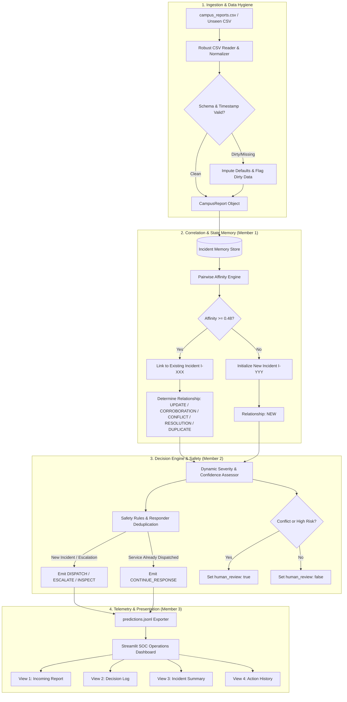

# Campus Crisis Agent — Architecture Description

**Team:** Divitiae Tech  
**Challenge:** Campus Crisis Agent (Student Challenge 2026)  
**Deliverable:** Technical Architecture & System Specification  

---

## 1. Executive Architecture Summary

The **Campus Crisis Agent** is an autonomous, stateful agentic system engineered to ingest campus crisis reports sequentially, correlate fragmented multi-source evidence into persistent incident clusters, and execute defensible emergency dispatch actions.

Rather than treating incoming reports as independent alarms, the agent embodies the foundational behavioral paradigm:

$$\text{Observe} \longrightarrow \text{Correlate} \longrightarrow \text{Assess} \longrightarrow \text{Decide} \longrightarrow \text{Act} \longrightarrow \text{Record} \longrightarrow \text{Monitor} \longrightarrow \text{Reassess}$$



---

## 2. The 8-Stage Agentic Loop

### Stage 1: Observe
- Ingests raw rows in **strict file order** (never sorting or reordering, respecting potentially malformed or unsynchronized timestamps).
- Flags missing values (`location`, `category`, `reported_severity`, `description`, `reporter_type`) and abnormal timestamp formatting without crashing.

### Stage 2: Correlate
- Evaluates candidate associations across all active incidents in the in-memory registry.
- Computes multi-factor affinity scoring:
  $$\text{Score} = w_{\text{loc}} \cdot S_{\text{location}} + w_{\text{cat}} \cdot S_{\text{category}} + w_{\text{text}} \cdot S_{\text{text\_overlap}}$$
- Reopens or correlates only when affinity exceeds empirical threshold ($0.48$).
- Resolves relationship semantics:
  - **`NEW`**: Uncorrelated event starting a fresh incident cluster.
  - **`UPDATE`**: Fresh details altering state or spatial parameters.
  - **`CORROBORATION`**: Consistent evidence reinforcing current confidence.
  - **`DUPLICATE`**: Verbatim repetitive reports (e.g. rapid automated sensor retries).
  - **`CONFLICT`**: Contradictory accounts (e.g., claiming no smoke when a fire is escalated).
  - **`RESOLUTION`**: Reports indicating completion, all-clear, or restoration.

### Stage 3: Assess
- Dynamic severity progression:
  - Critical reports from reliable eyewitnesses immediately elevate severity to `CRITICAL`.
  - Multiple concurring `MEDIUM` reports over time automatically escalate the incident to `HIGH` (weak signal accumulation).
  - Confidence updates: Corroborations raise confidence; conflicts penalize confidence by $-20\%$.

### Stage 4: Decide
- Maps incident domain to the fictional campus service directory (`campus_services.csv`):
  - Fire & Smoke $\rightarrow$ `SVC-FIRE` (Municipal Fire and Rescue)
  - Severe Medical Collapse $\rightarrow$ `SVC-EMS` (External Emergency Medical Services)
  - Routine First Aid $\rightarrow$ `SVC-MEDICAL`
  - Electrical & Power Failure $\rightarrow$ `SVC-ELECTRICAL`
  - Elevator Outage $\rightarrow$ `SVC-ACCESS` & `SVC-FACILITIES`
  - Network & Wi-Fi Degradation $\rightarrow$ `SVC-IT`
  - Contamination & Spills $\rightarrow$ `SVC-CLEANING`
  - Suspicious Activity $\rightarrow$ `SVC-SECURITY`

### Stage 5: Act (Deduplication & Safety Rules)
- **Duplicate-Action Avoidance:**
  - If a required service is already deployed to the incident, the agent refrains from issuing duplicate dispatches. It emits `CONTINUE_RESPONSE` to confirm ongoing operations without overwhelming emergency dispatchers.
  - Generates `[]` or `NO_NEW_ACTION` when existing coverage is sufficient.
- **Safety & Human Oversight:**
  - `human_review: true` is triggered when:
    1. Contradictory evidence (`CONFLICT`) is detected.
    2. High-consequence `CRITICAL` severity is claimed by an unverified source.
    3. Model confidence falls below threshold ($< 0.60$).

### Stage 6: Record
- Strictly serializes one JSON object per input report to `predictions.jsonl`:
  ```json
  {
    "report_id": "R104",
    "incident_id": "I003",
    "relationship": "CORROBORATION",
    "severity": "CRITICAL",
    "confidence": 0.92,
    "actions": [{"type": "CONTINUE_RESPONSE", "service_id": "SVC-FIRE"}],
    "incident_status": "ESCALATED",
    "human_review": false
  }
  ```

### Stage 7: Monitor & Reassess
- Tracks incident status progression through formal states:
  $$\text{INVESTIGATING} \longrightarrow \text{ACTIVE} \longleftrightarrow \text{ESCALATED} \longrightarrow \text{CONTROLLED} \longrightarrow \text{RESOLVED}$$
- Reopens resolved incidents if severe contradicting evidence emerges subsequently.

---

## 3. Member 3 Dashboard & Replay System Architecture

The dashboard provides deep observability into agent reasoning, adhering directly to the Student Brief Checklist:

| Dashboard View | Architectural Purpose | Checklist Compliance |
| :--- | :--- | :--- |
| **View 1: Incoming Report** | Telemetry ingestion queue, raw data inspector, and data hygiene diagnostics. | • Current input report is visible.<br/>• Flags dirty data and missing fields.<br/>• Live report injection simulator. |
| **View 2: Decision Log** | Deliberation audit trail with the 9 mandatory columns: `report ID`, `incident ID`, `relationship`, `severity`, `confidence`, `decision`, `service`, `status`, and `concise reason`. | • Every report appears in sequence.<br/>• **Fast filters for Conflicting Evidence, Confidence Drops, and Human Oversight.**<br/>• Transparent chain-of-thought rationale. |
| **View 3: Incident Summary** | Clustered incident status registry displaying current type, location, severity, confidence, reports, services, status, and action. | • **Interactive drill-down: Clicking an incident reveals its past reports and evolving assessment.**<br/>• Plotly cognitive confidence trend lines. |
| **View 4: Action History** | Audit log displaying action, service, time, and outcome/status. | • **Explicitly distinguishes NEW dispatches from CONTINUED actions (`CONTINUE_RESPONSE`).**<br/>• Campus services directory lookup. |

---

## 4. Sequential Replay Engine

- **State Snapshot Projection:** Every report processed generates a self-contained `ReplayTick` containing:
  - The incoming report and hygiene metadata.
  - The agent's decision and prediction record.
  - Snapshots of all active incident states and cumulative action records.
- **Playback Controls:** Scrubbing slider, Play/Pause, Step Forward/Back, First/Last, Reset, and variable playback speeds ($0.5\times$ to $5.0\times$).
- **Rubric Benchmark Presets:** Pre-indexes the four scenarios evaluated by judges:
  1. *Network Outage* (`Campus-wide` / `it`)
  2. *Smoke / Electrical Incident* (`Engineering Block E3` / `fire`)
  3. *Contractor Verification* (`Science Block loading bay` / `security`)
  4. *Lift / Accessibility Incident* (`Admin Block Lift A` / `accessibility`)
- **Unseen Data Support:** Instant ingestion of test CSV files (e.g. 300 unseen rows) directly through the browser.

---

## 5. Verification & Compliance Matrix

| Criterion | Challenge Requirement | Architectural Implementation |
| :--- | :--- | :--- |
| **Row Order** | Never reorder by timestamp | Sequential generator strictly processes rows in file sequence index $0 \dots N-1$. |
| **JSONL Output** | Exactly 1 line per report | Validated by Pydantic models with 1:1 row assertion. |
| **Duplicate Avoidance** | Avoid unnecessary repeat dispatches | Evaluates dispatched service sets; emits `CONTINUE_RESPONSE` when response is active. |
| **Observability** | Score clarity & defensibility | Human-readable concise reasons, conflict filters, and interactive incident drilldown. |
